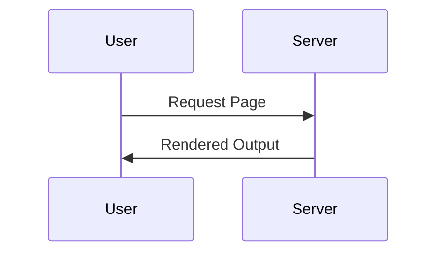

# Docusaurus Docker Search

[](https://github.com/CagriCatik/docusaurus-docker-search/actions/workflows/deploy.yml)
[](https://docusaurus.io)
[](https://mermaid.js.org)
[](https://www.docker.com)

This template provides a Docusaurus documentation site bundled with Docker support, enhanced Markdown Mermaid diagrams, and a local search engine. The repository includes GitHub Actions workflows, an isolated `webpage` directory for site code, container configuration, and Nginx static serving.

## Overview

- The project supplies a complete Docusaurus site with Mermaid rendering and built-in search.
- The `webpage` directory contains the full site source. Docker images deliver consistent builds served by Nginx.

## Requirements

Node.js 20 or newer
npm 9 or newer
Docker optional for container deployments

## Installation

```bash
git clone https://github.com/CagriCatik/docusaurus-docker-search.git
cd docusaurus-docker-search/webpage
npm install
```

## Development

```bash
npm run start
```

Local development server runs at [http://localhost:3000](http://localhost:3000).

## Build

```bash
npm run build
```

The `build/` directory is generated at the repository root.

## Search Feature

- A local zero dependency search engine is preconfigured.
- Index creation occurs during the build step and requires no external services.

## Mermaid Support

- Markdown files can embed diagrams using Mermaid syntax:



## Deployment

### GitHub Pages

Automated CI/CD is managed by `.github/workflows/deploy.yml`.

### Generic Static Hosting

Upload the contents of `build/` to any static hosting solution.

## Docker

**Build**

```bash
docker build -t docusaurus-site .
```

**Run**

```bash
docker run -d --name docs -p 80:80 docusaurus-site
```

Nginx uses the bundled `nginx.conf` to serve the Docusaurus build.

**.dockerignore**

```bash
node_modules
build
.DS_Store
```

## Configuration Notes

`docusaurus.config.js` manages site metadata, theme settings, plugins, and Mermaid config.
`sidebars.js` controls documentation navigation.
`src/` and `static/` house code, pages, and assets.
