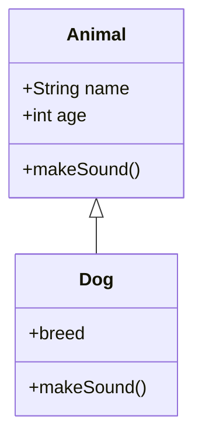
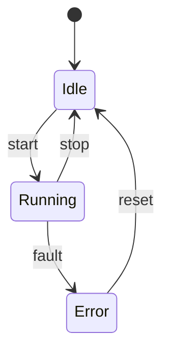
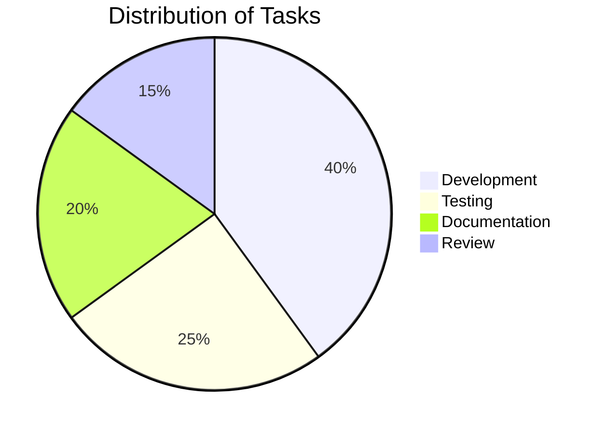

Mermaid diagrams can be embedded directly inside Markdown once Mermaid support is enabled in your Docusaurus configuration.

This page demonstrates several common Mermaid diagram types.

## Flowchart

```mermaid
flowchart TD
  A[Start] --> B{Decision}
  B -->|Yes| C[Perform action]
  B -->|No| D[Stop]
  C --> E[Finish]
````

## Sequence Diagram

```mermaid
sequenceDiagram
  participant User
  participant Server

  User->>Server: Request data
  Server-->>User: Respond with payload
  User->>Server: Acknowledge
```

## Class Diagram



## State Diagram



## Pie Chart



Mermaid supports many more diagram types, including ER diagrams, timelines, git graphs, and more. Integrating these diagrams allows technical concepts to be visualized directly within documentation.
